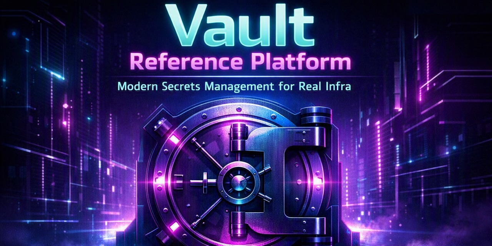

# Vault Reference Platform



A reference implementation for deploying and operating a highly available
[HashiCorp Vault](https://www.vaultproject.io/) cluster using Infrastructure
as Code and standard platform-engineering practices.

## Overview

This project packages a self-managed Vault deployment — Terraform for
provisioning, Ansible for configuration and hardening, Docker for local
development, and CI checks to keep it all honest — into something that can
be stood up repeatably instead of hand-built once and forgotten.

## Why this exists

Most public Vault examples stop at "here's a `vault server -dev` command."
Running Vault in production means dealing with unsealing, storage backends,
TLS, access policies, backups, and upgrades — the operational half of the
job that rarely makes it into a README. This repo is an attempt to write
that part down.

## Design goals

- **Reproducible** — the local profile stands up a real 3-node,
  auto-unsealed Raft cluster from a clean checkout with one command
  (`make deploy`). `terraform/aws` builds the equivalent on AWS —
  network, autoscaling group, load balancer, KMS auto-unseal, snapshot
  bucket. `terraform/azure` builds the same shape with a VM scale set,
  Key Vault auto-unseal, and a blob container. The AWS profile applies
  and destroys cleanly against an emulated AWS API on every PR; neither
  profile has been applied against a real account — see
  [`docs/cloud-apply.md`](docs/cloud-apply.md) for what that leaves
  unproven, and how to prove it.
- **HA by default** — the reference topology is a multi-node Raft cluster
  behind a load balancer from the start, not bolted on as a "v2" feature.
- **Operable, not just deployable** — runbooks and disaster-recovery
  procedures are first-class, not an afterthought.
- **Cloud-agnostic core** — Terraform modules are structured so the Vault
  and Ansible layers don't care whether the nodes came from AWS, Azure, or
  a local Docker Compose stack.

## Architecture

This is the topology `make deploy` actually stands up (local/CI). The AWS
profile builds the same shape with a load balancer and KMS auto-unseal in
front of it — see [`diagrams/architecture.md`](diagrams/architecture.md)
and [`docs/deployment.md`](docs/deployment.md):

```text
            vault CLI / apps
                    │
    ┌───────────────┬───────────────┐
    │               │               │
 vault-0         vault-1         vault-2
(leader)       (follower)      (follower)
    │               │               │
    └───────────────┴───────────────┘
                    │
              Raft cluster
                    │
           Transit auto-unseal
                    │
              vault-unseal
         (Shamir-unsealed once —
           the root of trust)
```

## Repository structure

```text
vault-reference-platform/
├── terraform/
│   ├── aws/        # AWS: VPC, ASG, NLB, KMS, snapshot bucket
│   ├── azure/      # Azure: VNet, VMSS, LB, Key Vault, snapshots
│   ├── local/       # Local/Docker provider for dev + CI
│   └── modules/     # Shared, provider-agnostic modules
├── ansible/
│   ├── playbooks/
│   ├── roles/
│   └── inventory/
├── docker/
│   ├── vault/         # Vault server image + config
│   ├── vault-unseal/  # Transit auto-unseal backend for the dev cluster
│   ├── dex/           # OIDC identity provider for human login
│   ├── monitoring/    # Prometheus + Grafana config
│   ├── tooling/       # CLI/dev tooling image
│   └── dev/           # docker-compose for local dev
├── scripts/           # bootstrap, auth, rotation, snapshots, PKI, DR,
│                      # cloud pre-flight and teardown
├── tests/             # test suites (see CI/CD below)
├── examples/          # example least-privilege policies
├── docs/              # runbooks and guides (index: docs/README.md)
├── diagrams/
├── .github/workflows/
├── Makefile
├── LICENSE
└── CONTRIBUTING.md
```

## Quick start

```bash
git clone https://github.com/sethbergman/vault-reference-platform.git
cd vault-reference-platform
make deploy   # 3-node Raft cluster, auto-unsealed, via Docker Compose
```

See [`docs/deployment.md`](docs/deployment.md) for cloud deployment via
Terraform + Ansible.

## Security

See [`docs/security.md`](docs/security.md) for the threat model, auto-unseal
approach, TLS handling, and policy structure.

## Auto-unseal

See [`docs/auto-unseal.md`](docs/auto-unseal.md) for how each profile
auto-unseals — Vault Transit locally/in CI, AWS KMS or Azure Key Vault in
the cloud profiles.

## Human authentication

See [`docs/human-authentication.md`](docs/human-authentication.md) for
OIDC login, with identity-provider groups mapped to Vault policies —
access is granted and revoked in the IdP, not per-person in Vault.

## CI authentication

See [`docs/ci-authentication.md`](docs/ci-authentication.md) for letting
GitHub Actions authenticate via OIDC — short-lived tokens minted per job,
no stored credential to leak or rotate.

## How an application gets a secret

Everything above configures Vault. `docker/vault-agent/` shows something
consuming it — and the notable part is negative: the application does not
authenticate, holds no token, and makes no Vault API call. It reads a
file that Vault Agent keeps current.

The consequence worth having is availability. The secret is already on
disk, so losing Vault stops new credentials being issued rather than
stopping the application. The integration suite proves it by stopping the
Vault node Agent talks to and checking the application can still reach
its database.

Agent does not solve secret zero — something still has to place an
AppRole credential on the host — but `--wrap-ttl` makes that handoff
single-use rather than a password in a file.

See [`docs/vault-agent.md`](docs/vault-agent.md).

## Dynamic secrets

Everything above stores secrets somebody created. `scripts/bootstrap-database-secrets.sh`
configures Vault to *issue* them instead — a database account that does
not exist until it is requested, belongs to one consumer, and is dropped
when its lease ends. PostgreSQL and MySQL are both supported behind the
same interface (`--engine`), and the differences that leak through are
documented rather than smoothed over.

The bootstrap ends by rotating the password of the account Vault itself
connects with, without reporting the new value. After that nobody knows
the database credential except Vault, which is the difference between
using Vault and keeping a password in it.

```bash
./scripts/bootstrap-dev-cluster.sh --with-database
./scripts/bootstrap-database-secrets.sh --password bootstrap-only-rotated-immediately
vault read database/creds/appdata-readonly
```

See [`docs/dynamic-secrets.md`](docs/dynamic-secrets.md).

## Secret rotation

See [`docs/secret-rotation.md`](docs/secret-rotation.md) for bootstrapping
AppRole roles and rotating `secret_id`s on a recurring cadence via
`scripts/bootstrap-approle.sh` and `scripts/rotate-secret-id.sh` — the
path for workloads that can't use OIDC.

## Disaster recovery

See [`docs/disaster-recovery.md`](docs/disaster-recovery.md) for backup and
restore procedures. `make dr-drill` runs the restore drill end to end — take a
snapshot, destroy the node and its storage, restore, verify the data came
back — and CI runs it on every PR, so the procedure can't rot unnoticed.

## Scheduled snapshots

Raft snapshots run hourly from a systemd timer on every node, installed by
the `vault_snapshots` Ansible role. Only the active node takes one;
standbys exit cleanly rather than failing a timer on two nodes out of
three. Retention is a server-side lifecycle rule, and the AWS instance
role deliberately has no `s3:DeleteObject` — a node that can prune backups
is a node that can destroy them.

See [`docs/disaster-recovery.md`](docs/disaster-recovery.md).

## Certificate renewal

Once a cluster is running, `scripts/bootstrap-pki.sh` configures Vault's
PKI engine to issue node certificates, and a daily timer renews them.
Certificates are short-lived (72h by default) so the renewal path is
exercised constantly rather than annually.

Vault's PKI cannot issue the certificates the cluster hosting it needs in
order to *start* — the bootstrap CA stays load-bearing until every node
has been re-issued. That ordering is spelled out in
[`docs/security.md`](docs/security.md); the role is off by default and
refuses to run on a node with no existing certificate.

## Terraform to Ansible

`scripts/terraform-to-ansible.sh` generates `group_vars` from
`terraform output -json`, so the KMS key id, subscription id and scale set
name cannot drift from what Terraform built. Nodes are discovered through
the cloud API by the same tag Raft's `auto_join` filters on, because both
clouds replace instances and a static inventory goes stale silently.

See [`docs/deployment.md`](docs/deployment.md).

## Before a cloud apply

Neither cloud profile has been applied against a real account, so the
first person to try is spending real money to find out what is wrong.
The emulated apply in CI settles that the AWS configuration is one the
API accepts; it says nothing about whether the cluster it describes
comes up.

```bash
./scripts/preflight-cloud.sh --cloud aws
```

It checks what can be checked for free — tooling, credentials, the
account you are about to spend in, the inputs that fail *late* — then
estimates cost and names what a teardown will not remove. It applies
nothing.

Two things it catches that cost money to discover otherwise: the AWS
profile ships `ssh_key_name` empty, so the default apply succeeds and
produces instances nobody can log into; and `az_count` drives one NAT
gateway per zone, which is roughly 60% of the bill — more than the Vault
nodes.

Tearing down needs its own script, because `terraform destroy` fails
partway on both profiles:

```bash
./scripts/teardown-cloud.sh --cloud aws
```

The AWS snapshot bucket is versioned with no `force_destroy`, so destroy
fails with `BucketNotEmpty` once a single snapshot exists — and deleting
the objects is not enough, because the delete markers are objects too.
The script empties both, then reports what survives on purpose: a KMS key
in its 7-day window, or an Azure Key Vault that purge protection keeps
soft-deleted for 90 days and that nobody can purge sooner.

[`docs/cloud-apply.md`](docs/cloud-apply.md) has the cost table and a
verification checklist — the ordered list of claims this repository makes
that only a real apply can settle.

## Audit logging

`scripts/bootstrap-audit.sh` enables audit devices — the only thing in
Vault that answers "who read that secret".

It enables **two** by default, and that is the important part. Vault
refuses to service requests when it cannot write to any enabled device,
so a single audit device turns a full disk into a total outage. Entries
are HMAC'd rather than recorded in clear, which is what makes the logs
safe to ship centrally.

The collector hash-chains entries as they arrive, because a log that
merely outlives the node still says whatever the last person with write
access wanted it to say — and a shorter log is indistinguishable from a
quieter day. `scripts/verify-audit-chain.sh` recomputes the chain from
the entries and reports the first sequence number that diverges.

Chaining alone stops a careless attacker, not a thorough one: whoever can
rewrite the log can recompute the chain over it. So a separate
`audit-anchor` service records the chain head to its own volume, with the
audit volume mounted read-only — a head recorded where the attacker
cannot reach still remembers what the trail used to say. Both volumes sit
on one Docker host, so this is tamper *evidence*, not tamper proofing,
and [`docs/audit.md`](docs/audit.md) says which is which.

See [`docs/audit.md`](docs/audit.md).

## Monitoring and alerting

Prometheus, Grafana and Alertmanager come up with
`--with-monitoring`. The alert rules are built around **absence** —
noticing when something stops — because that is the shape almost every
failure in this project has taken: a green timer and no backup, a
successful reload command and a stale certificate.

The trap they exist to avoid is worth stating plainly: a threshold alert
on a metric nobody reports never fires. So every freshness alert is
paired with an `absent()` alert, and the tests fail if a new one is added
without its partner.

See [`docs/monitoring.md`](docs/monitoring.md).

## Operations

See [`docs/operations.md`](docs/operations.md) for day-2 runbooks: health
checks, upgrades, capacity planning, and common incident response steps.

## CI/CD

GitHub Actions runs twenty-seven checks on every PR. Eight are static:
`terraform fmt`/`validate`/`test`, `ansible-lint`, `shellcheck`,
`markdownlint`, a shell-invariants check for patterns shellcheck has no
opinion about, a docs-index check that fails when
[`docs/README.md`](docs/README.md) stops matching the documents it
indexes, a static cloud pre-flight that checks the agreements no single
layer can see — Terraform against the cloud-init it renders, and that
against the Ansible layer which finishes the node — and security scanning
(gitleaks for committed secrets, Trivy for Terraform and Dockerfile
misconfigurations — see [`docs/security.md`](docs/security.md)).

Eleven run against fixtures and shims — fast, no credentials, and able to
reach failure modes a live cluster will not reproduce on demand:

- **Terraform to Ansible handoff** — generates `group_vars` from saved
  `terraform output -json` payloads and renders the real role template
  with them, so a rename on either side of the seam fails here.
- **Scheduled snapshot tests** — the cases that end in a green timer and
  no usable backup: an empty snapshot, a failed upload, a standby that
  should do nothing.
- **Vault PKI tests** — mostly what the renewal script must *refuse* to
  do, since almost every failure there ends with a node that cannot serve
  TLS.
- **Dynamic database credentials** — that the connection is scoped, the
  two roles grant genuinely different things, and root rotation happens
  last.
- **Alerting rules** — `promtool test rules` drives synthetic series
  through the real rule file, including the case where a series stops
  existing and the threshold alert consequently cannot fire.
- **Audit devices** — that two are enabled by default, that `--force`
  cannot disable the only one, and that an enable which succeeds without
  enabling anything is treated as a failure.
- **Audit chain and anchors** — that an altered, removed or planted
  entry is caught and located, and that a chain rewritten to be
  self-consistent over an edited log passes verification *without*
  anchors and fails *with* them, which is the whole reason they exist.
- **Alert routing** — that every alert in the rule file has a severity
  with a route of its own, since one with a typo falls through to the
  catch-all and is silently never paged; and that `amtool` agrees about
  where each label set goes.
- **PKI migration driver** — that trust is distributed before anything
  swaps, that a failed node stops the run, and that the bootstrap CA
  cannot be dropped while any node still presents one.
- **Vault Agent bootstrap** — that a credential and an identifier are
  not written with the same permissions, and that `--wrap-ttl` changes
  what lands on disk rather than only what is logged.
- **Cloud pre-flight and teardown** — that the pre-flight never runs
  `terraform apply`, that a missing key pair fails rather than warns, and
  that teardown empties the versioned bucket *before* calling destroy and
  keeps paging until the listing is empty.

One sits between the two. `tests/cloud-apply-emulated` runs a real
`terraform apply` of the AWS profile, through the real AWS provider,
against an implementation of the AWS API — so the configuration is
applied rather than planned, and destroyed again, without an account or a
bill. An emulator is not AWS: nothing boots and no health check runs, so
it is evidence the profile is applyable and not that the cluster works.
It shortens no claim in [`docs/cloud-apply.md`](docs/cloud-apply.md); it
removes the ones that never belonged there.

The remaining seven bring up the Docker Compose cluster and exercise it
for real:

- **Deploy + smoke test** — auto-unseals the full 3-node Raft cluster and
  does a live secret write/read.
- **AppRole rotation** — issues a `secret_id`, uses it, rotates it, and
  confirms the old one is rejected.
- **GitHub Actions OIDC** — logs in with a real GitHub-minted OIDC token,
  then confirms a role bound to a different repository rejects that same
  token and that the read-only policy denies writes.
- **Human OIDC** — runs a full browser-style login against a real OIDC
  provider, then confirms a developer and an operator get genuinely
  different access and that a wrong password fails.
- **DR restore drill** — snapshots a cluster, destroys the node and its
  storage, restores into a replacement, and verifies a secret written
  before the disaster reads back.
- **Rolling upgrade tests** — proves a bad checksum aborts before any
  node is touched, and that an unhealthy node stops the rollout rather
  than costing a second node and quorum.
- **Integration (real cluster)** — runs the operational scripts against
  the real three-node cluster: a snapshot Vault itself accepts back,
  standby detection against a node genuinely reporting 429, a certificate
  swap that leaves the node unsealed, still a voter, with its data intact
  and its process never restarted, and a database credential that
  connects, cannot write when it is readonly, and is dropped from
  `pg_roles` when its lease is revoked.

The last one exists because shims can only prove a script issues the
commands you expected. On its first run it found that snapshots had never
been taken on any node — the leadership check read a field that does not
exist in `vault status -format=json`, and the shim emitted that field
too, so both sides agreed and the suite stayed green. See
[`tests/integration/README.md`](tests/integration/README.md).

That incident and two others like it are written up in [Three green
timers and zero backups][post]: a shim that agreed with the bug, one that
disagreed with the environment, and a mocked provider that never modelled
the consumer at all.

[post]: https://sethbergman.github.io/posts/three-green-timers/

See [`.github/workflows/ci.yml`](.github/workflows/ci.yml).

## Roadmap

Everything through v0.14 has shipped — see
[Releases](https://github.com/sethbergman/vault-reference-platform/releases)
for the log. "Shipped" here means there is a test that fails if the
feature breaks, not that the code exists.

What stands between here and v1.0, in order:

1. **A real AWS apply.** `terraform/aws` has never been stood up end to
   end. It passes `terraform test` against mocked providers — which
   catches an IAM policy granting delete on the snapshot bucket — and it
   applies and destroys cleanly against an emulated AWS API, which
   settles that every request the profile makes is one the API accepts.
   Neither runs anything: a mock answers from a fixture, an emulator
   answers for real but boots nothing. What only a real apply settles:
   that the instance profile, the KMS key policy and the `seal` stanza
   agree; and that a terminated leader is replaced by a node which
   auto-unseals and rejoins unattended.
2. **A real Azure apply.** A separate item, not the same job twice.
   `terraform/azure` discovers peers through a scale set rather than
   tags, has a health probe with no status-code matcher, and reconciles
   a lost instance rather than replacing it — three mechanisms with no
   AWS counterpart, and the first is where mocked tests already missed a
   real bug. [`docs/cloud-apply.md`](docs/cloud-apply.md) lists what each
   apply would settle.
3. **Off-host audit shipping.** The audit trail now outlives the node,
   and an edit to it is now detectable: entries are hash-chained as they
   arrive, and a separate `audit-anchor` service holds the chain head
   where the collector cannot write, which catches even a chain rewritten
   to be self-consistent over an edited log.

   Both volumes still sit on the same Docker daemon, so this is tamper
   *evidence*, not tamper proofing, and the trail does not yet leave the
   machine. Shipping it somewhere else is the remaining half.

See [`docs/roadmap.md`](docs/roadmap.md) for what is planned, what is
deliberately excluded, and what "done" is taken to mean.

## License

MIT — see [`LICENSE`](LICENSE).

## Contributing

See [`CONTRIBUTING.md`](CONTRIBUTING.md).
