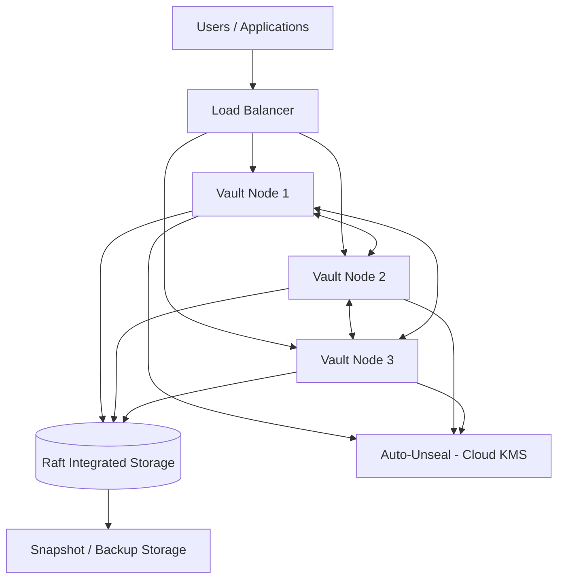

# Architecture

## High availability topology

## Notes

- **Storage backend**: Raft integrated storage is used instead of an
  external Consul cluster, to keep the operational surface area smaller
  for a reference deployment.
- **Auto-unseal**: production nodes use a cloud KMS (AWS KMS / Azure Key
  Vault) for auto-unseal; the local Docker Compose profile uses Shamir
  shares for simplicity, documented in `docs/deployment.md`.
- **Load balancer**: health-checks the Vault `/v1/sys/health` endpoint so
  standby nodes aren't sent client traffic that requires an active leader.
- **Backups**: scheduled Raft snapshots are shipped to object storage; see
  `docs/disaster-recovery.md` for restore procedure.
