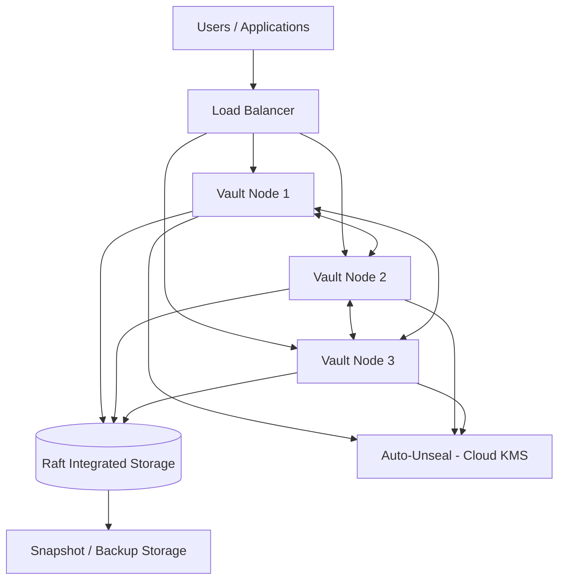

# Architecture

## High availability topology

```mermaid
flowchart TD
    U[Users / Applications] --> LB[Load Balancer]
    LB --> V1[Vault Node 1]
    LB --> V2[Vault Node 2]
    LB --> V3[Vault Node 3]
    V1 <--> V2
    V2 <--> V3
    V1 <--> V3
    V1 --> R[(Raft Integrated Storage)]
    V2 --> R
    V3 --> R
    R --> S[Snapshot / Backup Storage]
    V1 --> AU[Auto-Unseal - Cloud KMS]
    V2 --> AU
    V3 --> AU
```

## Notes

- **Storage backend**: Raft integrated storage is used instead of an
  external Consul cluster, to keep the operational surface area smaller
  for a reference deployment.
- **Auto-unseal**: production nodes use a cloud KMS (AWS KMS / Azure Key
  Vault); the local Docker Compose profile uses Vault Transit instead —
  same `seal` stanza shape, no cloud account needed. See
  `docs/auto-unseal.md`.
- **Load balancer**: health-checks `/v1/sys/health?standbyok=true`, which
  keeps standby nodes *in* the pool rather than ejecting them — a healthy
  standby answers 200 and Vault forwards whatever needs the leader.
  Ejecting them would leave one node serving everything with nothing in
  the load balancer saying why. The exception is a snapshot, which the
  leader alone serves: `scripts/dr-drill-cloud.sh` looks the leader up
  instead of dialling the load balancer, and found that out the hard way.
  See item 4 in `docs/cloud-apply.md`.
- **Backups**: scheduled Raft snapshots are shipped to object storage; see
  `docs/disaster-recovery.md` for restore procedure.
